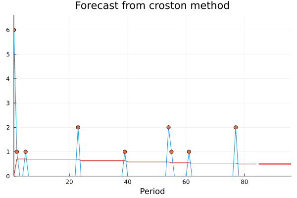
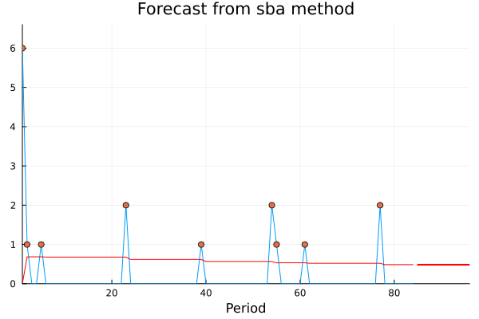
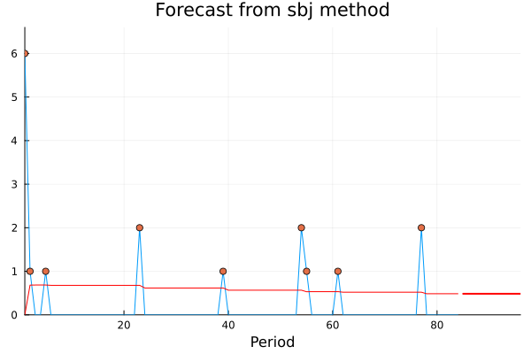

# IntermittentDemand

“IntermittentDemand” is a Julia package that provides functions for
forecasting and analyzing intermittent time series, which are time
series with long periods of zeros or near-zeros, and occasional non-zero
observations.

The package currently includes functions for forecasting intermittent
time series using following methods: Croston’s method, Syntetos-Boylan Approximation, Shale-Boylan-Johnston method. 
Additionally, the package provides API for plotting the implemented methods.

To install “IntermittentDemand”, you can clone the repository
directly from GitHub. Open a Julia REPL and enter the following
commands:

    ] # enter package mode
    add https://github.com/Akai01/IntermittentDemand.jl.git

After the package is added, you can import the necessary functions into
your Julia script or notebook and start using them.

If you have any feedback or suggestions for the package, or if you
encounter any issues while using it, please feel free to open an issue
on the package’s GitHub repository. We welcome contributions and
feedback from the community to improve this package.

# Examples

## Data

    data = [6, 1, 0, 0, 1, 0, 0, 0, 0, 0, 0, 0, 0, 0, 0, 0, 0,
    0, 0, 0, 0, 0, 2, 0, 0, 0, 0, 0, 0, 0, 0, 0, 0, 0, 0, 0, 0,
    0, 1, 0, 0, 0, 0, 0, 0, 0, 0, 0, 0, 0, 0, 0, 0, 2, 1, 0, 0, 0,
    0, 0, 1, 0, 0, 0, 0, 0, 0, 0, 0, 0, 0, 0, 0, 0, 0, 0, 2, 0, 0, 
    0, 0, 0, 0, 0];

## Forecasting using Croston method

    fc = crost(data = data, h = 12, w = missing, init= "mean", nop = 2, method = "croston", cost = "mar", init_opt = true, na_rm = false);

## Plot

    using Plots;
    plot(fc)

## Forecasting using Syntetos-Boylan approximation method

    fc = crost(data = data, h = 12, w = missing, init= "mean", nop = 2, method = "sba", cost = "mar", init_opt = true, na_rm = false);

## Plot

    using Plots;
    plot(fc)

## Forecasting using Shale-Boylan-Johnston method

    fc = crost(data = data, h = 12, w = missing, init= "mean", nop = 2, method = "sbj", cost = "mar", init_opt = true, na_rm = false);

## Plot

    using Plots;
    plot(fc)

# References :

* Kourentzes N (2022). _tsintermittent: Intermittent Time Series Forecasting_. R package version 1.10, <https://CRAN.R-project.org/package=tsintermittent>.

* Optimisation of the methods described in:
N. Kourentzes, 2014, On intermittent demand model optimisation and selection, International Journal of Production Economics, 156: 180-190. <https://www.sciencedirect.com/science/article/abs/pii/S092552731400190X?via%3Dihub>. <https://kourentzes.com/forecasting/2014/06/11/on-intermittent-demand-model-optimisation-and-selection/>
